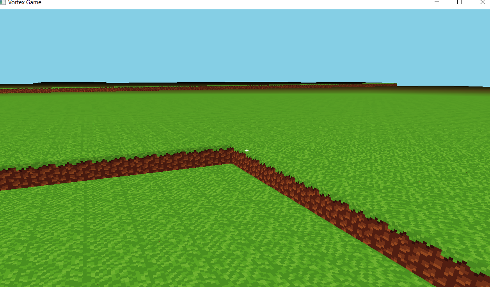
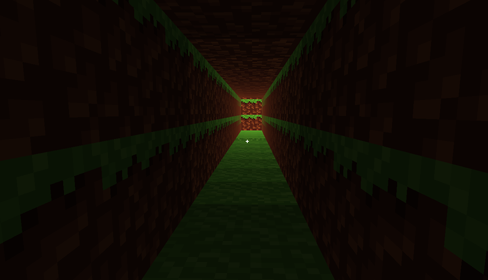

I'll update the documentation with more detailed technical information based on the code you've provided. Here's the enhanced version:

# LegendOfVirelia - Voxel Game Engine

A Java-based voxel game engine built with OpenGL, featuring client-server architecture, chunk-based world rendering, advanced lighting system, and extensible command-based networking.

## 📋 Table of Contents

- [Features](#features)
- [Architecture](#architecture)
- [Getting Started](#getting-started)
- [Project Structure](#project-structure)
- [System Components](#system-components)
- [Technical Deep Dive](#technical-deep-dive)
- [Screenshots](#screenshots)
- [Roadmap](#roadmap)
- [Contributing](#contributing)
- [License](#license)

## ✨ Features

### Currently Implemented

- **Rendering Engine**
  - OpenGL-based 3D voxel rendering with per-vertex lighting
  - Chunk-based world rendering (16×16×16 chunks) with optimized mesh generation
  - External 3D model loading via JSON format with texture atlas support
  - Advanced lighting system:
    - Sunlight propagation with day/night cycle
    - Block light sources (e.g., torches with configurable light levels 0-15)
    - Cross-chunk light propagation
    - Smooth per-vertex lighting with ambient occlusion
  - Texture atlas system with automatic UV mapping
  - Frustum culling for efficient rendering

- **World Management**
  - Block placement and breaking with raycast detection
  - Chunk loading/unloading system with configurable view distance
  - World state persistence and synchronization
  - Multi-threaded chunk mesh generation
  - Automatic neighboring chunk updates on block changes
  - Block registry system with dynamic ID assignment

- **Networking & Synchronization**
  - Threaded client-server architecture
  - Command-based communication protocol with type safety
  - Client-side prediction for responsive gameplay
  - Server-authoritative world state
  - Queue-based command processing (ConcurrentLinkedQueue)
  - Supported commands:
    - `BreakBlockCommand` - Remove blocks from world
    - `PlaceBlockCommand` - Add blocks to world
    - `ClientReadyCommand` - Client initialization handshake
    - `GenerateWorldCommand` - Procedural world generation trigger
    - `PlaceBlockConfirmCommand` - Server confirmation for actions

- **Lighting System**
  - Dual lighting channels (sunlight + block light)
  - Flood-fill light propagation algorithm
  - Real-time lighting updates on block changes
  - Day/night cycle support with dynamic light intensity
  - Light level range: 0-15 (Minecraft-style)
  - Automatic neighboring chunk light updates

- **User Interface**
  - Component-based UI system
  - Supported components:
    - `Container` - Hierarchical layout management
    - `Label` - Text rendering with configurable fonts
    - `ColorRect` - Solid color rectangles with alpha support
  - Crosshair overlay for block targeting
  - Screen-space coordinate system (1280×720 default)

- **Game Loop**
  - Fixed timestep server updates (20 TPS)
  - Variable framerate client rendering
  - Delta-time based updates for smooth animations
  - Separate client and server game loops running concurrently

### 🚧 In Development

- **Physics System** - Collision detection, gravity, AABB collision resolution
- **Procedural World Generation** - Noise-based terrain, biomes, caves
- **Extended UI Components** - Buttons, text inputs, inventory grids, pause menus
- **Advanced Lighting** - Colored lights, dynamic shadows, global illumination
- **Entity System** - Mobs, NPCs, physics-based entities

## 🏗️ Architecture

### Client-Server Model

```
┌─────────────────────────┐         ServerCommand           ┌─────────────────────────┐
│      Client Side        │ ──────────────────────────────► │      Server Side        │
│                         │                                 │                         │
│  ClientGameLogic        │         ClientCommand           │  ServerGameLogic        │
│  ClientWorldState       │ ◄────────────────────────────── │  ServerWorldState       │
│                         │                                 │                         │
│  - Input Handling       │     CommunicationBridge         │  - World Authority      │
│  - Rendering            │     (Queue-based transfer)      │  - Command Validation   │
│  - Client Prediction    │                                 │  - State Broadcast      │
│  - UI Management        │                                 │  - Chunk Generation     │
└─────────────────────────┘                                 └─────────────────────────┘
```

### WorldState Architecture

Both client and server extend the abstract `WorldState<T, U>` class:

```java
// Client receives ClientCommand from server, sends ServerCommand to server
ClientWorldState extends WorldState<ClientCommand, ServerCommand>

// Server receives ServerCommand from client, sends ClientCommand to client
ServerWorldState extends WorldState<ServerCommand, ClientCommand>
```

**Key Components:**
- `incomingCommands`: Queue for commands received from the network
- `outgoingCommands`: Queue for commands to send over network
- `chunksToUpdate`: List of chunks that need mesh regeneration
- `nextActionId`: Atomic counter for client-side prediction

### Threading Model

```
Main Thread
├── Server Thread (Daemon)
│   ├── processClientToServer()    // Transfer commands from client queue
│   ├── serverLogic.update(1/20)  // 20 TPS fixed timestep
│   └── processServerToClient()   // Transfer commands to client queue
│
└── Client Thread (Main)
    ├── input()                   // Process user input
    ├── update(delta)            // Update game state with delta time
    │   ├── processServerActions()      // Apply server confirmations
    │   ├── processClientActions()      // Client-side prediction
    │   └── world.update(delta)         // Update world state
    └── render()                 // Render frame
        ├── renderer.render()            // 3D world rendering
        └── uiRenderer.render()          // 2D UI overlay
```

### Communication Bridge

The `CommunicationBridge` simulates network communication in single-player mode:

```java
// Transfer client actions to server
Queue<ServerCommand> clientActions = clientWorld.getOutgoingCommands();
while ((action = clientActions.poll()) != null) {
    serverWorld.receiveServerCommands(action);
}

// Transfer server responses to client
Queue<ClientCommand> serverActions = serverWorld.getOutgoingCommands();
while ((action = serverActions.poll()) != null) {
    clientWorld.receiveServerCommands(action);
}
```

## 🚀 Getting Started

### Prerequisites

- **Java 8+** (Java 11+ recommended)
- **OpenGL 3.3+** compatible graphics card
- **LWJGL 3.x** (Lightweight Java Game Library)
- **Gradle** for building

### Building the Project

```bash
# Clone the repository
git clone https://github.com/yourusername/LegendOfVirelia.git
cd LegendOfVirelia

# Build using Gradle
./gradlew build

# Run the game
./gradlew run
```

### Controls

- **Mouse Left** - Break block (default mode) / Place block (build mode)
- **Mouse Right** - Place block (default mode) / Break block (build mode)
- **B** - Toggle build mode (swap left/right click behavior)
- **Y** - Toggle debug mode
- **ESC** - Exit game

### Configuration

The engine uses several configuration constants:

```java
// Chunk configuration (Chunk.java)
SIZE_X = 16, SIZE_Y = 16, SIZE_Z = 16
MAX_LIGHT_LEVEL = 15

// World configuration (World.java)
viewDistance = 6  // Chunks to render around player

// Building system (ClientGameLogic.java)
cooldown = 0.1f   // Seconds between block place/break
maxReach = 5.0f   // Maximum block interaction distance
```

## 📁 Project Structure

```
LegendOfVirelia/
├── src/
│   ├── org/
│   │   ├── legendofvirelia/
│   │   │   ├── Main.java                    # Application entry point
│   │   │   ├── client/
│   │   │   │   └── ClientGameLogic.java     # Client game loop & input
│   │   │   ├── server/
│   │   │   │   └── ServerGameLogic.java     # Server game loop
│   │   │   └── shared/
│   │   │       ├── ClientWorldState.java    # Client-side world state
│   │   │       ├── ServerWorldState.java    # Server-side world state
│   │   │       ├── WorldState.java          # Abstract world state
│   │   │       ├── EntityState.java         # Entity data structure
│   │   │       └── command/
│   │   │           ├── Command.java         # Base command interface
│   │   │           ├── ClientCommand.java   # Client-bound commands
│   │   │           ├── ServerCommand.java   # Server-bound commands
│   │   │           └── commands/
│   │   │               ├── BreakBlockCommand.java
│   │   │               ├── PlaceBlockCommand.java
│   │   │               ├── ClientReady.java
│   │   │               └── PlaceBlockConfirmCommand.java
│   │   │
│   │   ├── engine/
│   │   │   ├── io/
│   │   │   │   ├── Input.java               # Keyboard/mouse input
│   │   │   │   └── Window.java              # GLFW window wrapper
│   │   │   ├── loop/
│   │   │   │   ├── GameLoop.java            # Main game loop
│   │   │   │   ├── ClientSide.java          # Client interface
│   │   │   │   └── ServerSide.java          # Server interface
│   │   │   ├── rendering/
│   │   │   │   ├── Renderer.java            # 3D rendering pipeline
│   │   │   │   ├── ShaderProgram.java       # Shader management
│   │   │   │   ├── Texture.java             # Texture binding
│   │   │   │   ├── TextureLoader.java       # Texture loading
│   │   │   │   ├── UIRenderer.java          # 2D UI rendering
│   │   │   │   └── UIText.java              # Text rendering
│   │   │   └── utils/
│   │   │       ├── Debug.java               # Debug utilities
│   │   │       ├── Logger.java              # Logging system
│   │   │       └── Resource.java            # Resource loading
│   │   │
│   │   └── game/
│   │       ├── core/
│   │       │   └── GameObject.java          # Base game object
│   │       ├── entities/
│   │       │   └── Camera.java              # First-person camera
│   │       ├── lighting/
│   │       │   └── DirectionalLight.java    # Sunlight implementation
│   │       ├── meshes/
│   │       │   ├── Mesh.java                # Base mesh class
│   │       │   ├── LightedMesh.java         # Mesh with lighting data
│   │       │   ├── Mesh2D.java              # 2D UI mesh
│   │       │   ├── Model.java               # 3D model container
│   │       │   ├── ModelLoader.java         # JSON model loader
│   │       │   ├── MeshConverter.java       # Model conversion
│   │       │   └── Quad.java                # Face generation
│   │       ├── ui/
│   │       │   ├── ColorRect.java           # Colored rectangle UI
│   │       │   ├── Container.java           # UI layout container
│   │       │   └── Label.java               # Text label
│   │       ├── utils/
│   │       │   └── AtlasBuilder.java        # Texture atlas builder
│   │       └── world/
│   │           ├── Block.java               # Block definition
│   │           ├── BlockPlacer.java         # Raycast & placement
│   │           ├── BlockRegistry.java       # Block ID registry
│   │           ├── Blocks.java              # Block definitions
│   │           ├── Chunk.java               # Chunk data structure
│   │           ├── ChunkLightingSystem.java # Light propagation
│   │           ├── ChunkMesher.java         # Mesh generation
│   │           ├── World.java               # World container
│   │           └── WorldRenderer.java       # World rendering
│   │
├── resources/
│   ├── assets/
│   │   ├── models/                          # Block models (JSON)
│   │   │   ├── dirt.json
│   │   │   └── torch.json
│   │   └── textures/                        # Block textures
│   └── shaders/
│       ├── cube.vert                        # Vertex shader
│       ├── cube.frag                        # Fragment shader
│       ├── ui.vert                          # UI vertex shader
│       └── ui.frag                          # UI fragment shader
│
└── build.gradle                             # Build configuration
```

## 🎮 System Components

### Block System

Blocks are registered with unique IDs and support custom properties:

```java
// Block registration (ClientGameLogic.java)
BlockRegistry.register("dirt", Blocks.DIRT.get());
BlockRegistry.register("torch", Blocks.Torch.get());

// Block definitions (Blocks.java)
public static Supplier<Block> DIRT = () -> new Block("dirt");
public static Supplier<Block> Torch = () -> new Block("dirt", 15); // Light level 15
```

**Block Properties:**
- `model`: 3D mesh loaded from JSON
- `isTransparent`: Determines if light passes through
- `lightLevel`: Light emission (0-15), used for torches, lava, etc.

### Chunk System

Chunks are 16×16×16 sections of the world with integrated lighting:

```java
public class Chunk {
    private int[][][] blocks;           // Block IDs
    private byte[][][] sunlight;        // Sunlight levels (0-15)
    private byte[][][] blocklight;      // Block light levels (0-15)
    private Model model;                // Rendered mesh
    private boolean lightingDirty;      // Needs lighting recalculation
}
```

**Chunk Features:**
- Automatic mesh regeneration on block changes
- Cross-chunk light propagation
- Neighboring chunk updates for seamless lighting

### Lighting System

The `ChunkLightingSystem` implements flood-fill light propagation:

**Sunlight Calculation:**
```java
// Cast sunlight from top of chunk downward
for (int y = SIZE_Y - 1; y >= 0; y--) {
    if (!isTransparent(x, y, z)) {
        currentLight = 0; // Block stops sunlight
    }
    setSunlight(x, y, z, currentLight);
}
```

**Light Propagation Algorithm:**
1. Start with light sources (sun at top, torches, etc.)
2. Add to queue with initial light level
3. For each queued node:
   - Decrease light level by 1
   - Check 6 neighboring blocks
   - If transparent and new light > existing light:
     - Update light value
     - Add neighbor to queue
4. Continue until queue is empty

**Cross-Chunk Propagation:**
```java
// Handle chunk boundary crossing
if (nx < 0) {
    targetChunkX--;
    localX = SIZE_X - 1;
} else if (nx >= SIZE_X) {
    targetChunkX++;
    localX = 0;
}
// Propagate to neighboring chunk
Chunk targetChunk = world.getChunk(targetChunkX, targetChunkZ);
```

### Raycast System

Block interaction uses DDA-based voxel raycasting:

```java
public static RaycastResult raycast(World world, Camera camera, float maxReach) {
    Vector3f rayStart = camera.getPosition();
    Vector3f rayDir = camera.getForward();
    Vector3f step = rayDir.normalize().mul(0.1f); // 0.1 block steps
    
    for (float distance = 0; distance < maxReach; distance += 0.1f) {
        int blockX = (int) Math.floor(current.x);
        int blockY = (int) Math.floor(current.y);
        int blockZ = (int) Math.floor(current.z);
        
        Block hitBlock = world.getBlockAt(blockX, blockY, blockZ);
        if (hitBlock != null && blockId != 0) {
            return new RaycastResult(true, blockPosition, lastEmptyPos, distance);
        }
        current.add(step);
    }
}
```

**Returns:**
- `blockPosition`: The block that was hit
- `placePosition`: Adjacent empty position for placing blocks
- `distance`: How far the ray traveled

### Command System

Commands are type-safe and implement a common interface:

```java
public interface Command<T extends WorldState<?, ?>> {
    void execute(T worldState);
}
```

**Example Command Flow:**

**Client places block:**
```java
PlaceBlockCommand action = new PlaceBlockCommand(position, blockId);
clientWorld.sendCommand(action);  // Adds to outgoingCommands queue
```

**Communication bridge transfers:**
```java
ServerCommand action = clientActions.poll();
serverWorld.receiveServerCommands(action); // Adds to incomingCommands queue
```

**Server processes:**
```java
while ((command = incomingCommands.poll()) != null) {
    command.execute(this); // Modifies authoritative world state
}
```

**Server confirms to client:**
```java
ClientCommand confirmation = new PlaceBlockConfirmCommand(position, blockId);
serverWorld.sendCommand(confirmation);
```

### Client-Side Prediction

The client immediately applies actions for responsive gameplay:

```java
public void placeBlock() {
    PlaceBlockCommand action = new PlaceBlockCommand(position, blockId);
    worldState.sendCommand(action);  // Send to server
    // Block is placed immediately on client for instant feedback
    // Server confirmation will reconcile any conflicts
}
```

### Mesh Generation

The `ChunkMesher` generates optimized meshes with per-vertex lighting:

```java
// Only render faces adjacent to transparent blocks (culling)
if (isFaceVisible(world, worldX, worldY, worldZ, dx, dy, dz)) {
    addFaceWithLighting(vertices, texCoords, indices, chunk, x, y, z, faceType, blockId);
}

// Vertex data includes position + light level
vertices.add(vx);     // X position
vertices.add(vy);     // Y position
vertices.add(vz);     // Z position
vertices.add(light);  // Light level (0.0 - 1.0)
```

**Lighting Sampling:**
```java
// Sample light from ADJACENT block (where face is looking)
int[] offset = getFaceOffset(faceType);
int sampleX = blockX + offset[0];
int sampleY = blockY + offset[1];
int sampleZ = blockZ + offset[2];

byte sunlight = lightingSystem.getSunlightWithNeighbors(chunk, sampleX, sampleY, sampleZ);
byte blocklight = lightingSystem.getBlocklightWithNeighbors(chunk, sampleX, sampleY, sampleZ);

float maxLight = Math.max(sunlight * dayNightCycle, blocklight);
```

### Model Loading

External models are loaded from JSON with texture mapping:

```json
{
  "elements": [
    {
      "from": [0, 0, 0],
      "to": [16, 16, 16],
      "faces": {
        "north": {"uv": [0, 0, 16, 16], "texture": "#dirt"},
        "south": {"uv": [0, 0, 16, 16], "texture": "#dirt"},
        "east": {"uv": [0, 0, 16, 16], "texture": "#dirt"},
        "west": {"uv": [0, 0, 16, 16], "texture": "#dirt"},
        "up": {"uv": [0, 0, 16, 16], "texture": "#dirt"},
        "down": {"uv": [0, 0, 16, 16], "texture": "#dirt"}
      }
    }
  ],
  "textures": {
    "dirt": "dirt"
  }
}
```

### Texture Atlas

The `AtlasBuilder` combines textures into a single atlas:

```java
AtlasBuilder atlas = AtlasBuilder.create("assets/textures", 1600, 16);
float[] uvRect = atlas.getUV("dirt"); // Returns [uMin, vMin, uMax, vMax]
```

## 🔧 Technical Deep Dive

### Day/Night Cycle

The lighting system supports dynamic day/night cycles:

```java
// Update sun direction and intensity
sun.updateForTimeOfDay(time); // time: 0.0 (midnight) to 1.0 (noon)

// Regenerate meshes with new lighting
WorldRenderer.updateDayNightCycle(world, dayNightCycle);
```

### Performance Optimizations

**Frustum Culling:**
```java
renderer.render(model, camera, light, position, chunkCenter, radius);
// Only renders chunks visible in camera frustum
```

**Face Culling:**
```java
// Only render faces adjacent to air/transparent blocks
if (isFaceVisible(world, x, y, z, dx, dy, dz)) {
    addFace(...);
}
```

**Chunk Updates:**
```java
// Only regenerate chunks that changed
if (!chunksToUpdate.isEmpty()) {
    rerenderChunks(); // Batch updates
}
```

### Thread Safety

The engine uses thread-safe data structures for client-server communication:

```java
protected Queue<T> incomingCommands = new ConcurrentLinkedQueue<>();
protected Queue<U> outgoingCommands = new ConcurrentLinkedQueue<>();
```

### Shader System

**Vertex Shader (cube.vert):**
```glsl
layout(location = 0) in vec3 position;
layout(location = 1) in vec2 texCoord;
layout(location = 2) in float lightLevel;  // Per-vertex lighting

out vec2 fragTexCoord;
out float fragLightLevel;

void main() {
    gl_Position = projection * view * model * vec4(position, 1.0);
    fragTexCoord = texCoord;
    fragLightLevel = lightLevel;
}
```

**Fragment Shader (cube.frag):**
```glsl
in vec2 fragTexCoord;
in float fragLightLevel;
out vec4 fragColor;

uniform sampler2D textureSampler;

void main() {
    vec4 texColor = texture(textureSampler, fragTexCoord);
    fragColor = texColor * fragLightLevel; // Apply lighting
}
```

## 📸 Screenshots

### World Rendering
*[Showcase chunk-based terrain with lighting]*



### Lighting System
*[Demonstrate sunlight, block light, and day/night cycle]*



---

## 🗺️ Roadmap

### Phase 1: Core Mechanics (Current)
- [x] Client-server architecture
- [x] Chunk rendering system
- [x] Block placement/breaking
- [x] Lighting system (sunlight + block light)
- [x] Day/night cycle
- [x] Command-based networking

### Phase 2: Physics & Movement
- [ ] Player collision detection (AABB)
- [ ] Gravity and jumping
- [ ] Flying mode
- [ ] Sprint and crouch mechanics
- [ ] Smooth camera movement

### Phase 3: World Generation
- [ ] Perlin/Simplex noise terrain
- [ ] Biomes (desert, forest, mountains)
- [ ] Cave systems
- [ ] Ore generation
- [ ] Structure generation (trees, buildings)

### Phase 4: Advanced Features
- [ ] Inventory system
- [ ] Crafting mechanics
- [ ] Multiple block types (stairs, slabs, glass)
- [ ] Water and fluid simulation
- [ ] Particle effects

### Phase 5: Multiplayer
- [ ] Real network protocol (TCP/UDP)
- [ ] Server browser
- [ ] Player authentication
- [ ] Anti-cheat measures
- [ ] Chat system

### Phase 6: Polish & Content
- [ ] Sound effects and music
- [ ] Advanced graphics (shadows, reflections)
- [ ] Mob system (AI, pathfinding)
- [ ] Weather system
- [ ] Modding API

## 🤝 Contributing

Contributions are welcome! Here's how you can help:

### Areas of Interest

1. **Physics System** - Implement AABB collision and player movement
2. **World Generation** - Create noise-based terrain generators
3. **UI System** - Expand UI components (buttons, text input, inventory)
4. **Networking** - Replace CommunicationBridge with real sockets
5. **Performance** - Optimize mesh generation and rendering

### Development Setup

```bash
# Fork and clone
git clone https://github.com/yourusername/LegendOfVirelia.git
cd LegendOfVirelia

# Create feature branch
git checkout -b feature/amazing-feature

# Make changes and test
./gradlew test
./gradlew run

# Commit and push
git commit -m 'Add amazing feature'
git push origin feature/amazing-feature
```

### Code Style

- Use **4 spaces** for indentation
- Follow **Java naming conventions**
- Add **Javadoc** comments for public APIs
- Keep methods under **50 lines** when possible
- Write **descriptive commit messages**

### Testing

```bash
# Run tests
./gradlew test

# Run with debug mode
./gradlew run --args="--debug"
```

## 📄 License

This project is licensed under the MIT License - see the LICENSE file for details.

## 🙏 Acknowledgments

- **LWJGL** - Java bindings for OpenGL, GLFW, and more
- **Minecraft** - Inspiration for voxel mechanics and lighting
- **OpenGL Community** - Rendering techniques and best practices
- **JOML** - Java OpenGL Math Library for vector/matrix operations

## 📚 Resources

- [LWJGL Documentation](https://www.lwjgl.org/guide)
- [OpenGL Tutorial](https://learnopengl.com/)
- [Voxel Lighting Algorithms](https://0fps.net/2013/07/03/ambient-occlusion-for-minecraft-like-worlds/)
- [Chunk Management Techniques](https://tomcc.github.io/2014/08/31/visibility-1.html)

---

**Built with ❤️ using Java and OpenGL**

*For questions or support, please open an issue on GitHub.*
